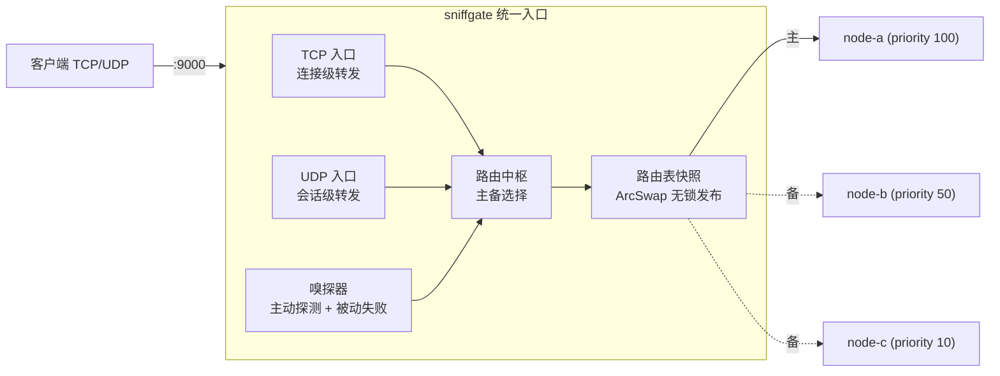
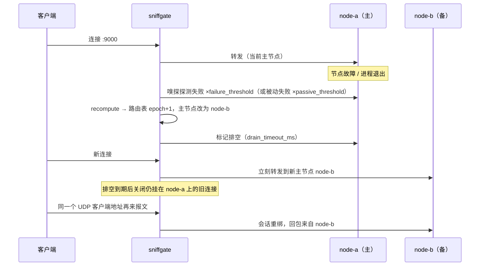

# sniffgate

> 多节点**嗅探**主备**热切换**网关 —— 对外只暴露统一入口（TCP / UDP），内部对多个后端节点做健康嗅探，主节点故障时秒级切到备用节点；**改配置文件即生效，无需重启**。

[](https://github.com/yxpil/sniffgate/actions/workflows/ci.yml)


---

## 这个程序解决什么问题

一组后端服务（比如自建 DNS、Redis、OpenVPN、游戏/语音服务、IoT 上报端口）同时提供 TCP 和 UDP 能力时，
外网客户端通常只能写死一个 IP:Port。一旦这个 IP 挂掉，客户端必须改配置才能恢复。

`sniffgate` 把这件事收敛到一层：

```text
                         ┌──────────────── sniffgate ────────────────┐
 客户端 ──► 10.0.0.1:9000 │  TCP 统一入口 →  路由中枢（主备选择）      │ ──► 主节点 node-a
 客户端 ──► 10.0.0.1:9000 │  UDP 统一入口 →  （嗅探结果驱动）          │ ┈┈► 备节点 node-b
   (TCP/UDP 同端口)      │  嗅探器：主动探测 + 被动失败摘除           │ ┈┈► 备节点 node-c
                         └───────────────────────────────────────────┘
```

* **对外统一访问**：客户端只认入口地址；TCP、UDP 可以是同一个端口号（各协议独立监听）。
* **嗅探**：每个节点一个嗅探任务，周期性做 TCP 连接探测 / UDP 请求-响应探测（可带探测载荷与期望响应）；
  同时统计真实转发的失败次数（**被动嗅探**），窗口内失败达阈值立即摘除节点。
* **主备热切换**：`priority` 最大的健康节点为主，其余为备。判定主节点不可用后，新连接立刻走新主节点；
  旧连接按 `drain_timeout_ms` 排空（默认 10s 后关闭，`0` = 立即断开）；UDP 在途会话可即时重绑到新主节点。
* **文件配置修改**：改 `config.toml` 保存即生效——节点增删改、入口增删改（端口变化自动重启该入口）、
  策略/阈值/超时全部在线生效；解析失败时自动保留旧配置继续跑，并把错误暴露在控制口。

---

## 特性一览

| 能力 | 说明 |
| --- | --- |
| TCP 统一入口 | 连接级双向转发（`copy_bidirectional`），转发失败自动换下一个节点重试 |
| UDP 统一入口 | 会话级转发（客户端地址 → 独立后端套接字），空闲回收，切换重绑 |
| 主动嗅探 | 周期探测 + 超时 + N 次失败降级 / M 次成功恢复；支持 `tcp` / `udp` / `auto` / `none` |
| 被动嗅探 | 真实转发失败计数，窗口内达阈值立即摘除，避免等探测周期 |
| 主备热切换 | `priority` 主备；另支持 `round_robin` / `weighted` 多活 |
| 连接排空 | 降级节点上已有连接在排空超时后关闭，避免「半死」连接长期占用 |
| 配置热加载 | 文件轮询，增删改节点/入口/全局参数；失败保留旧配置 |
| 运维控制口 | 行式 JSON / 文本命令：状态、统计、手动切主、自动、启停节点、立即重载、切换历史 |
| 无锁热路径 | 路由表用 `ArcSwap` 发布不可变快照，转发线程零阻塞 |
| 跨平台 | Linux / Windows / macOS，纯 Rust + tokio，无 C 依赖 |

---

## 快速开始

```bash
# 1. 编译
git clone https://github.com/yxpil/sniffgate.git
cd sniffgate
cargo build --release           # 产物: ./target/release/sniffgate(.exe)

# 2. 生成配置
./target/release/sniffgate --gen-config > config.toml

# 3. 按需修改 config.toml（入口地址、节点地址、优先级…），校验配置
./target/release/sniffgate --config config.toml --check

# 4. 启动
./target/release/sniffgate --config config.toml
```

启动日志会打印对外入口、后端节点、当前主节点与控制口地址。验证与运维：

```bash
# 查看状态（也可用 nc 127.0.0.1 9100 手动敲命令）
./target/release/sniffgate --admin 127.0.0.1:9100 --cmd status

# 手动把主节点切到 node-b，然后恢复自动选主
./target/release/sniffgate --admin 127.0.0.1:9100 --cmd '{"cmd":"switch","node":"node-b"}'
./target/release/sniffgate --admin 127.0.0.1:9100 --cmd '{"cmd":"auto"}'

# 临时停用某个节点 / 改完文件立即生效（不必等轮询）
./target/release/sniffgate --admin 127.0.0.1:9100 --cmd '{"cmd":"disable","node":"node-c"}'
./target/release/sniffgate --admin 127.0.0.1:9100 --cmd '{"cmd":"reload"}'
```

命令行参数：

| 参数 | 说明 |
| --- | --- |
| `-c, --config <PATH>` | 配置文件路径，默认 `config.toml` |
| `--check` | 只校验配置并退出（退出码非 0 表示不合法，适合 CI / 发布前检查） |
| `--gen-config` | 打印带注释的示例配置 |
| `--log <LEVEL>` | 覆盖配置里的日志级别（`trace/debug/info/warn/error`） |
| `--admin <ADDR>` `--cmd <CMD>` | 以客户端身份向控制口发一条命令（`--cmd -` 进入交互模式） |

---

## 配置说明（TOML）

完整带注释示例见 [`config.example.toml`](config.example.toml)，下面是最小可用配置：

```toml
[global]
strategy = "priority"            # priority 主备 | round_robin | weighted 多活
admin_listen = "127.0.0.1:9100"  # 运维控制口，"" 关闭

[[listeners]]                    # 对外统一入口，可多个
name = "tcp-public"
protocol = "tcp"
listen = "0.0.0.0:9000"

[[listeners]]
name = "udp-public"
protocol = "udp"
listen = "0.0.0.0:9000"          # TCP/UDP 用同一个端口号也没问题

[[nodes]]
name = "node-a"
priority = 100                   # 越大越优先
tcp = "10.0.0.11:9000"
udp = "10.0.0.11:9000"
probe = "auto"                   # auto | tcp | udp | none

[[nodes]]
name = "node-b"
priority = 50
tcp = "10.0.0.12:9000"
udp = "10.0.0.12:9000"
probe = "auto"
```

### `[global]` 参数

| 参数 | 默认 | 说明 |
| --- | --- | --- |
| `log_level` | `info` | `trace/debug/info/warn/error` |
| `strategy` | `priority` | `priority` 主备；`round_robin` / `weighted` 多活 |
| `admin_listen` | `127.0.0.1:9100` | 运维控制口，填 `""` 关闭 |
| `config_poll_interval_ms` | `1000` | 配置文件热加载轮询间隔 |
| `probe_interval_ms` | `1000` | 嗅探周期（节点可用 `probe_interval_ms` 覆盖） |
| `probe_timeout_ms` | `800` | 单次探测超时 |
| `connect_timeout_ms` | `3000` | 连接后端超时 |
| `failure_threshold` | `3` | 连续失败 N 次判定不可用 |
| `success_threshold` | `2` | 连续成功 N 次判定恢复 |
| `connect_retry` | `3` | 单次请求最多尝试的后端个数 |
| `passive_eject_threshold` | `3` | 被动嗅探：窗口内失败 N 次立即摘除 |
| `passive_eject_window_ms` | `5000` | 被动嗅探统计窗口 |
| `drain_timeout_ms` | `10000` | 降级节点旧连接的排空时间，`0` = 立即断开 |
| `udp_session_timeout_ms` | `60000` | UDP 会话空闲回收时间 |
| `udp_rebind_on_switch` | `true` | 切换时把在途 UDP 会话重绑到新主节点 |
| `fail_open` | `true` | 所有节点都不健康时仍按优先级兜底转发（避免整体黑洞） |
| `shutdown_grace_ms` | `5000` | 退出时等待在途连接收尾的时间 |

### `[[nodes]]` 参数

| 参数 | 默认 | 说明 |
| --- | --- | --- |
| `name` | 必填 | 节点名（唯一） |
| `enabled` | `true` | 是否参与调度（控制口也可在线启停） |
| `priority` | `0` | 越大越优先（主备的核心） |
| `weight` | `1` | `weighted` 策略下的权重 |
| `tcp` / `udp` | 可省 | 后端地址；至少填一个，按协议分别可选 |
| `probe` | `auto` | `auto`=有 tcp 探 tcp 否则探 udp；`none`=只靠被动摘除 |
| `probe_payload` | 空 | 探测载荷；普通文本或 `hex:0d0a` 形式（保留 `\r\n`） |
| `probe_expect` | 空 | 期望响应包含的字符串，空 = 任何响应/仅连接成功即算通 |
| `probe_interval_ms` | 空 | 覆盖全局嗅探周期 |
| `remark` | 空 | 备注，仅展示 |

> 配置项写错（含字段名拼写错误）会**在热加载时被拒绝并保留旧配置**，控制口的 `reload` 字段会给出原因。

---

## 主备热切换是怎么做的



一次故障切换的时序：



判定顺序（`priority` 策略）：

1. 候选 = `enabled` 且有该协议地址的节点；
2. 优先健康节点；若全不健康：`fail_open = true` 时按优先级兜底，否则拒绝转发；
3. 手动 `switch` 指定的节点优先（一旦它不可用会自动解除）；
4. 优先级相同时看当前在途 TCP 连接数（少者优先），再按名称稳定排序。

---

## 运维控制口

默认监听 `127.0.0.1:9100`（建议只对本机/跳板机开放）。支持**行式 JSON** 与**纯文本命令**，一行一条，返回一行 JSON：

```bash
nc 127.0.0.1 9100
status
{"cmd":"switch","node":"node-b","protocol":"udp"}
{"cmd":"disable","node":"node-a"}
{"cmd":"reload"}
quit
```

| 命令 | 说明 |
| --- | --- |
| `status` | 运行状态：主节点、节点健康、入口、热加载状态、最近切换历史 |
| `stats` | 累计统计（连接数、失败数、会话数、字节数、探测次数、被动摘除次数…） |
| `reload` | 立即从磁盘重新加载配置（等同保存文件后不等轮询） |
| `switch <node> [tcp\|udp]` | 手动指定主节点（粘滞；不写协议则作用于该节点支持的协议） |
| `auto [tcp\|udp]` | 取消手动指定，恢复自动选主 |
| `enable/disable <node>` | 在线启用 / 停用节点（下次文件热加载以文件内容为准） |
| `health <node> up\|down` | 手动标记健康状态（后续探测会自动修正） |
| `help` / `quit` | 帮助 / 断开 |

`status` 返回示例（截断）：

```json
{
  "engine": "sniffgate", "version": "0.1.0", "uptime_s": 128, "epoch": 7,
  "strategy": "priority",
  "active": { "tcp": "node-b", "udp": "node-b" },
  "pins": { "tcp": null, "udp": null },
  "listeners": [{ "name": "tcp-public", "protocol": "tcp", "listen": "0.0.0.0:9000" }],
  "nodes": [
    { "name": "node-a", "healthy": false, "state": "unhealthy",
      "last_error": "TCP 探测连接失败 (10.0.0.11:9000): Connection refused",
      "draining": false, "inflight_tcp": 0,
      "stats": { "tcp_conns_total": 12, "tcp_conns_failed": 4, "probe_fail": 3 } }
  ],
  "reload": { "ok": true, "at_ms": 1760000000000, "message": "热加载成功：…" },
  "recent_switches": [
    { "epoch": 7, "protocol": "tcp", "from": "node-a", "to": "node-b",
      "reason": "probe-fail", "ts_ms": 1760000000000 }
  ]
}
```

---

## 部署

* Linux（systemd 单元文件现成可用）：[`docs/DEPLOY.md`](docs/DEPLOY.md)
* Windows（WinSW 注册为服务，含示例 XML）：[`docs/DEPLOY.md`](docs/DEPLOY.md)
* Docker：[`Dockerfile`](Dockerfile)
* 架构与设计取舍：[`docs/ARCHITECTURE.md`](docs/ARCHITECTURE.md)
* 运维手册（典型场景 / 排查 / FAQ）：[`docs/OPS.md`](docs/OPS.md)

```bash
# Docker
docker build -t sniffgate .
docker run -d --name sniffgate -p 9000:9000/tcp -p 9000:9000/udp \
  -p 127.0.0.1:9100:9100 -v $PWD/config.toml:/etc/sniffgate/config.toml:ro sniffgate
```

> 监听 1024 以下端口时：Linux 用 `setcap cap_net_bind_service=+ep`（见部署文档），Windows 直接以服务账号运行。

---

## 测试

```bash
cargo test                      # 13 个单元测试 + 2 个端到端测试
cargo clippy --all-targets -- -D warnings
cargo fmt --all -- --check
```

端到端测试（`tests/integration.rs`）会真实启动三个 TCP+UDP 回显后端与一个 gateway 进程，验证：

1. TCP / UDP 统一入口转发（同一个端口号）；
2. 控制口 `switch` / `auto` / `disable` / `enable`；
3. 杀掉主节点后端后的**秒级热切换**；
4. 在途 UDP 会话在切换时被**重绑**到新主节点；
5. 修改配置文件后的**热加载**（新增 node-c 并接管为主）；
6. 配置写错时热加载失败但**旧配置继续工作**；
7. `--gen-config` / `--check` 行为。

---

## 项目结构

```text
src/
  main.rs        CLI、启动编排、退出信号、切换事件日志
  config.rs      配置模型 + 校验 + 示例配置内嵌
  state.rs       节点视图、健康状态机、路由表快照、主备选择、排空
  health.rs      主动嗅探（TCP 连接 / UDP 请求-响应）+ 端口重试绑定
  tcp_proxy.rs   TCP 统一入口（连接级转发 + 排队降级连接）
  udp_proxy.rs   UDP 统一入口（会话表 + 空闲回收 + 切换重绑）
  admin.rs       运维控制口（status/stats/reload/switch/auto/enable/disable/health）
  reload.rs      配置文件监听与热加载
  supervisor.rs  任务栈：嗅探/入口/控制口的增删改
  client.rs      控制口客户端（--admin/--cmd）
  ctx.rs         进程级共享上下文与切换历史
```

---

## Roadmap

* [ ] 端口白名单 / ACL 与 `PROXY protocol` 支持
* [ ] `weighted` 平滑加权轮询（SWRR）
* [ ] 指标导出（Prometheus `/metrics`）
* [ ] 多实例一致性（控制口广播 / 集群选主）
* [ ] eBPF/`SO_REUSEPORT` 多线程收包（超高性能场景）

欢迎 issue / PR。

## License

MIT © 2026 yxpil

---

<div align="center">

<a href="https://github.com/yxpil/sniffgate">
  
</a>

<sub>Powered by <a href="https://alittlecatgirlpanel.yxp.hk"><b>gh-card</b></a> · 粉色手写体 README 仓库名片</sub>

</div>
