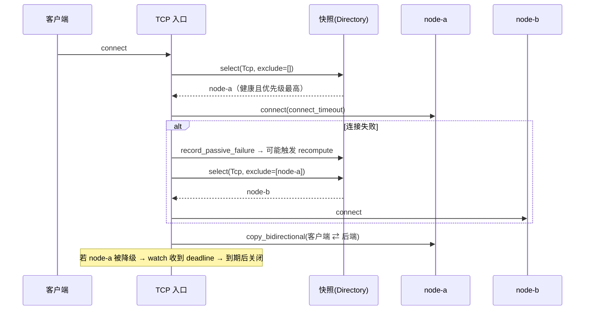

# 架构与设计取舍

## 1. 总体结构

```text
                       ┌──────────────────────────────────────────┐
   客户端 ──TCP:9000──► │ tcp_proxy   ──┐                          │
   客户端 ──UDP:9000──► │ udp_proxy   ──┤                          │
                       │               ▼                          │
                       │        Directory（路由中枢）              │
                       │   ┌──────────────────────────────┐       │
                       │   │ Runtime 快照（不可变，ArcSwap）│       │
                       │   │  epoch / nodes / active_tcp  │       │
                       │   │  active_udp / global / 入口   │       │
                       │   └──────────────────────────────┘       │
                       │               ▲                          │
                       │  health::probe_loop × N（每节点一个）     │
                       │  admin（控制口）  reload（文件监听）      │
                       └──────────────────────────────────────────┘
```

| 模块 | 职责 |
| --- | --- |
| `config.rs` | TOML 配置模型、严格校验（未知字段即报错）、示例配置内嵌 |
| `state.rs` | `NodeHandle`（配置 + 健康 + 统计 + 排空信号）、`Runtime` 快照、`Directory` 路由中枢 |
| `health.rs` | 主动嗅探循环（TCP 连接 / UDP 请求响应）、端口重试绑定 |
| `tcp_proxy.rs` | TCP 统一入口：选路 → 连接 → 双向转发 → 排空/退出 |
| `udp_proxy.rs` | UDP 统一入口：会话表、每会话后端套接字、空闲回收、切换重绑 |
| `admin.rs` | 运维控制口（行式 JSON / 文本命令） |
| `reload.rs` | 配置文件 mtime+size 轮询 → 解析 → 应用 |
| `supervisor.rs` | 任务栈：按当前配置对齐嗅探/入口/控制口任务集合 |
| `ctx.rs` | 共享上下文：路由中枢、退出信号、TaskTracker、热加载状态、切换历史 |

## 2. 为什么这样设计

### 2.1 路由表用不可变快照 + `ArcSwap`

热切换的关键是「切换瞬间不能让转发线程阻塞」。因此：

* 所有路由信息（节点列表、当前主节点、全局参数、入口配置）打包成一份**不可变** `Runtime`；
* 发布新版本 = `ArcSwap::store(Arc::new(new_runtime))`，读侧 `load()` 是原子读，无锁无等待；
* 每个新连接/新会话读取一次快照；在途连接继续用自己的后端，不受切换影响（除非排空到期）。

代价是快照内的 `Arc<NodeHandle>` 是共享的可变状态（健康标记、统计、排空信号），
这些用原子量与细粒度锁处理，不参与快照版本管理。

### 2.2 健康状态机：主动 + 被动双通道

```text
          连续失败 ≥ failure_threshold                  连续成功 ≥ success_threshold
 Healthy ───────────────────────────► Unhealthy ───────────────────────────────► Healthy
    ▲                                     │  ▲                                        ▲
    │  被动失败 ≥ passive_eject_threshold  │  │  （真实转发失败计数）                    │
    └─────────────────────────────────────┘  └────────────────────────────────────────┘
 Unknown（启动初值，按可用处理，避免冷启动黑洞）
```

* **主动**决定「恢复」（避免假死节点长期不被使用），**被动**决定「快速摘除」（用户已经感受到失败，不必再等探测周期）。
* 只有**状态发生变化**时才调用 `Directory::recompute()`，避免探测风暴。
* 探测成功后清空被动失败窗口，避免刚恢复就被历史计数再次摘除。
* `failure_threshold = 1` + `probe_interval_ms = 200` 可以得到亚秒级故障发现（端到端测试即用这套参数）。

### 2.3 排空（drain）语义

节点被降级时，给它的 `watch` 通道写入一个**绝对时间戳**（`now + drain_timeout_ms`）：

* 该节点上的每条 TCP 连接都持有该通道的接收端；到期即关闭连接；
* 若期间节点又被提升为主节点，通道复位为 `0`，等待中的连接**继续正常转发**并回到等待状态（不会误杀）；
* 新连接不会落在排空中的节点上（`select()` 会优先过滤掉它们），只有 `fail_open` 兜底时才可能选中。

UDP 会话没有「连接」概念，切换时直接**重绑**：`udp_rebind_on_switch = true` 时，
会话收到切换事件立刻把后端地址换成新的主节点（同一个客户端地址，回包来自新节点）。

### 2.4 配置热加载

* 轮询 `mtime + 文件长度`（默认 1s，可配），避免依赖平台专有 watch API（Windows/网络盘都稳）；
* 应用顺序：**解析 + 校验 → 更新节点集合（就地替换，健康统计不丢）→ 发布路由表 → 对齐任务栈**；
* 失败即 `reload.ok = false`，错误原因写入控制口状态，**旧配置继续服务**；
* 入口地址变了 → 重启该入口任务（新任务带指数退避重试绑定，避免与旧任务的端口释放竞态）；
* 节点被删除 → 取消其嗅探任务；新增节点 → 立即启动嗅探（未知状态按可用处理，可以马上承载流量）。

### 2.5 退出

收到 `Ctrl-C` / `SIGTERM` 后：取消退出信号 → 取消所有任务 → `TaskTracker::wait()` 等待在途连接收尾，
最多等 `shutdown_grace_ms`，然后打印累计统计退出。

## 3. 一次请求的完整路径（TCP）



`connect_retry` 控制最多尝试多少个节点；每次失败都会计入被动统计，从而让「下一次」连接直接走新主节点。

## 4. 已知取舍

| 取舍 | 原因 | 影响 |
| --- | --- | --- |
| 配置文件轮询而非 inotify/ReadDirectoryChangesW | 跨平台无依赖、网络盘可靠 | 生效延迟 ≤ `config_poll_interval_ms` |
| 单 UDP 前端套接字（非 `SO_REUSEPORT`） | 逻辑简单、会话表集中 | 单核收包上限；高 PPS 场景见 Roadmap |
| TCP 只做透传，不解析应用层 | 通用、无感知 | 不支持按应用层路由 |
| 节点连接失败即尝试下一个（最多 `connect_retry`） | 缩短用户可感知故障窗口 | 极端情况下重试耗时可能叠加 |
| 就地更新节点配置、保留健康状态 | 避免热加载把统计清零 | 改了地址后仍可能短暂沿用旧健康结果（下一个探测周期纠正） |
